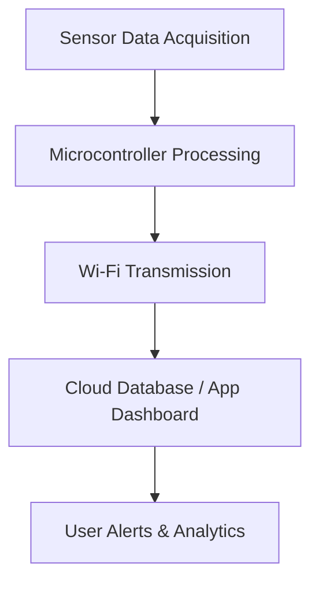

# IoT-Based Air Quality Detection in Truck Cabins 🚛🌫️

An embedded system that continuously monitors and reports the air quality inside truck cabins using real-time sensors, microcontrollers, and IoT technologies — ensuring safer and healthier working environments for long-haul drivers.

## 🔧 Problem Statement
Truck drivers are exposed to poor air quality during long hours on highways, which can impact their health and alertness. This project detects harmful gas concentrations and environmental parameters in real time, helping mitigate health risks.

## ⚙️ Key Features
- 📡 **Real-time Air Quality Monitoring**
- 🔗 **Sensor Integration (MQ135, DHT11, CO Sensor)**
- 🌐 **IoT Connectivity (ESP8266)**
- 📲 **Data Visualization on Mobile App/Web UI**
- 🔋 **Low Power Consumption + Reliable Data Logging**
- 🛑 **Alerts for Critical AQ Levels**

## 🔬 Tech Stack & Components
- **Microcontroller**: NodeMCU (ESP8266)
- **Sensors**: MQ-135 (Air Quality), DHT11 (Temp & Humidity), CO Sensor
- **Communication**: Wi-Fi (IoT using Blynk / Thingspeak / Firebase)
- **Power**: Battery + USB + Voltage Regulator
- **Software**: Arduino IDE, Embedded C, Circuit Design Tools

## 🧠 System Flow

## 📑 Documentation

This project was also published in **IEEE Xplore** under the title:  
**“IoT-Based Air Quality Detection in Truck Cabin”**  
📎 [(https://ieeexplore.ieee.org/document/10170384)]

---

## 🚀 Future Scope

- 🗺️ **GPS-Integrated Air Quality Mapping**: Track and record AQI across routes for real-time mapping.
- ☀️ **Solar-Powered Module**: Enhance system sustainability and enable off-grid operation.
- 🧠 **Predictive Health Analytics**: Use historical AQ data to generate driver health insights and early warnings.
